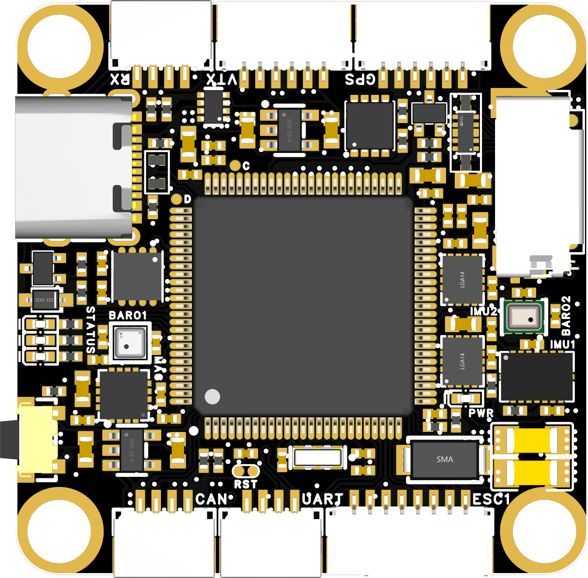

# SkySakura H743 Flight Controller

The SkySakura H743 is a flight controller produced by [SkySakuraRC]

## Features

 - MCU: STM32H743VIT6, 480MHz
 - Gyro1: ICM42688
 - Gyro2: IIM42652
 - SD Card support
 - BEC output: 5V 5A & 12V 5A (MAX 60W total) 
 - Barometer1: DPS310
 - Barometer2: ICP20100
 - Magnometer: IST8310
 - CAN bus support
 - 7 UARTS: (USART1, USART2, USART3, UART4, USART6, UART7 with flow control, UART8)
 - 2 I2C, I2C1 is used internally.
 - 13 PWM outputs (12 motor outputs, and 1 led)
 - 4-12s wide voltage support

## Pinout

## UART Mapping

The UARTs are marked Rn and Tn in the above pinouts. The Rn pin is the
receive pin for UARTn. The Tn pin is the transmit pin for UARTn.
|Name|Pin|Function|
|:-|:-|:-|
|SERIAL0|COMPUTER|USB|
|SERIAL1|RX7/TX7|UART7 (MAVLink2, flow-control-capable)|
|SERIAL2|TX1/RX1|UART1 (MAVLink2, DMA-enabled)|
|SERIAL3|TX2/RX2|UART2 (SPARE, DMA-enabled)|
|SERIAL4|TX3/RX3|UART3 (GPS1, DMA-enabled)|
|SERIAL5|TX4/RX4|UART4 (RCIN, DMA-enabled)|
|SERIAL6|TX6/RX6|UART6 (VTX, DMA-enabled)|
|SERIAL7|TX8/RX8|UART8 (ESC-Telemetry)|

## Safety Button
SkySakura H743 supports safety button, with connection to sh1.0 6 pin connector, with buzzer and safety led on the same connector.
Safety button is default to be disabled and can be enabled by setting the following parameter:
 - BRD_SAFETY_DEFLT 1

## RC Input

RC input is configured on the on UART4 with sh1.0 connector. It supports all serial RC protocols. DJI sbus needs solder connection for the solder pad and are connected to UART4, inversion for UART4 needs to be configured.

## OSD Support

SkySakura H743 only supports HD OSD through uart connection. However, external spi is provided and an external AT7456E can be connected to enable analog OSD.

## PWM Output

The SkySakura H743 has 13 PWM outputs. M1-M8 are linked to sh1.0 8 pin connectors. All 8 outputs support bi-directional DShot and DShot. Output 9-13 support normal Dshot and 13 is configured as LED.

The PWM are in in two groups:

 - PWM 1-2 in group1
 - PWM 3-4 in group2
 - PWM 5-6 in group3
 - PWM 7-8 in group4
 - PWM 9-12 in group5
 - PWM 13 in group6

Channels within the same group need to use the same output rate. If
any channel in a group uses DShot then all channels in the group need
to use DShot.

## Battery Monitoring

The board has a builtin voltage sensor. The voltage sensor can handle up to 12S LiPo batteries. Current sensor and BATT2 moniter is present.
BATT2 voltage input is 6.6V capable, voltage divider resistor is 10k/10k so maximum input on batt2 pad is 13.2V.
ADC3 pad is BATT2 current input, ADC4 pad is BATT2 voltage input.

The correct battery setting parameters are:

 - BATT_MONITOR 4
 - BATT_VOLT_PIN 10
 - BATT_VOLT_MULT 34
 - BATT_CURR_PIN 11
 - BATT2_MONITOR 4
 - BATT2_VOLT_PIN 12
 - BATT2_CURR_PIN 13
 - BATT2_VOLT_MULT 10

These are set by default in the firmware and shouldn't need to be adjusted

## Compass

The SkySakura H743 have a builtin IST8310 compass.

## NeoPixel LED

PWM13 provides external NeoPixel LED support.

## Loading Firmware

Initial firmware load can be done with DFU by plugging in USB with the
bootloader button pressed. Then you should load the "with_bl.hex"
firmware, using your favourite DFU loading tool.

Once the initial firmware is loaded you can update the firmware using
any ArduPilot ground station software. Updates should be done with the
*.apj firmware files.
